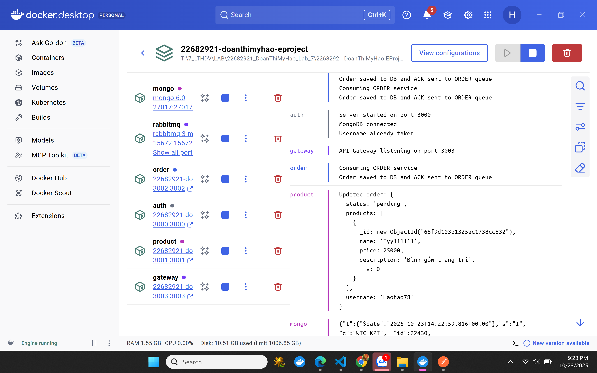
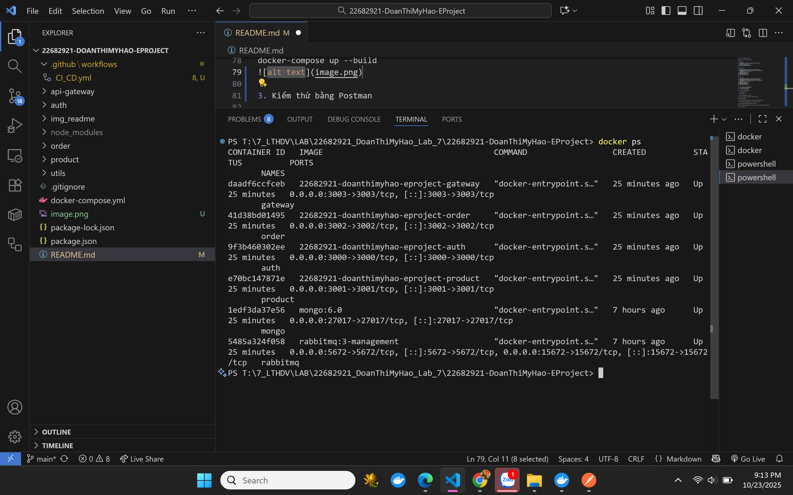
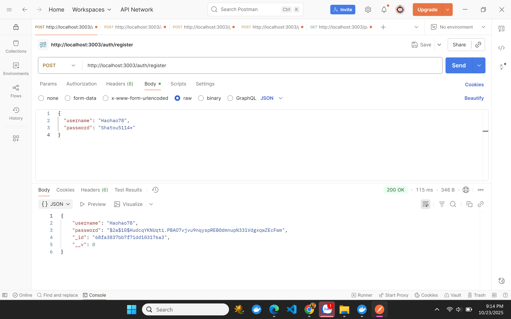
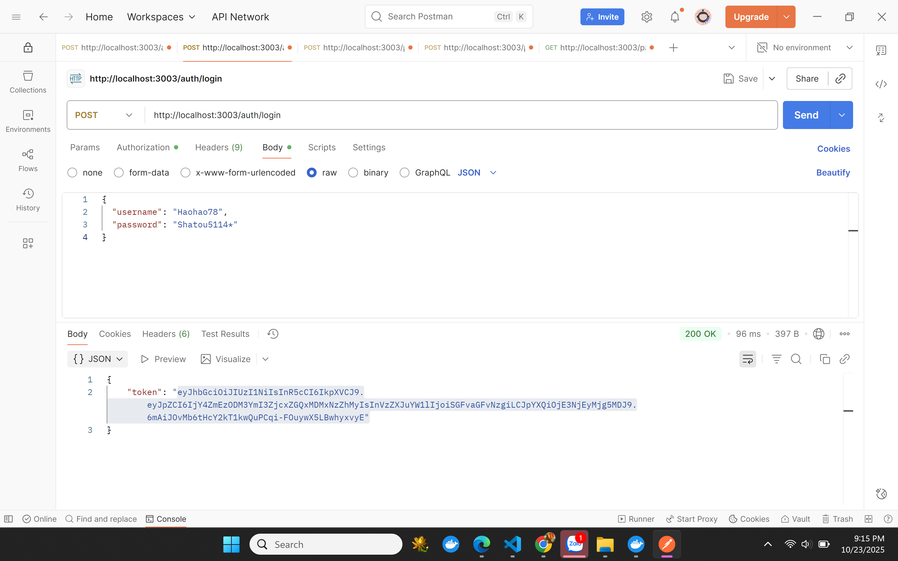
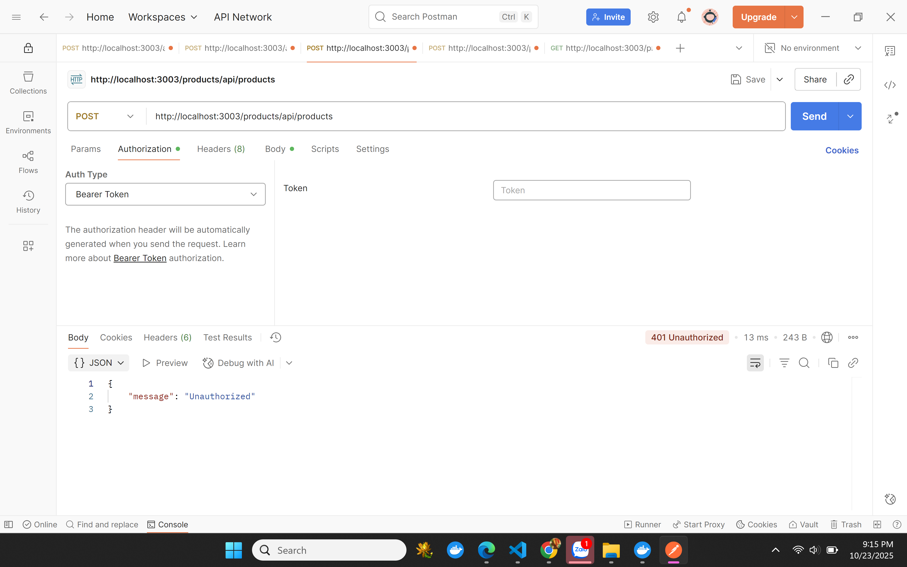
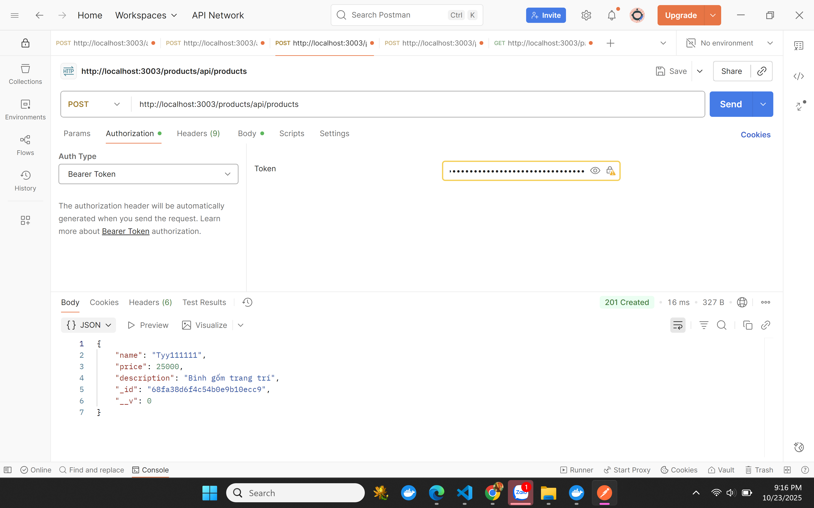
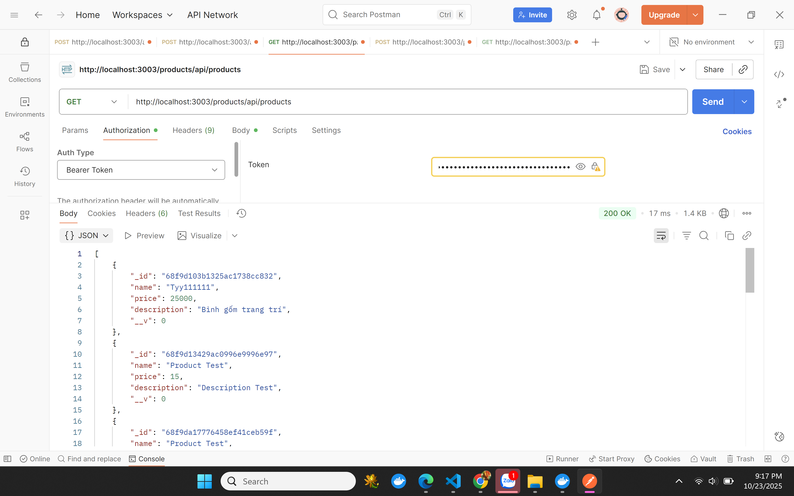
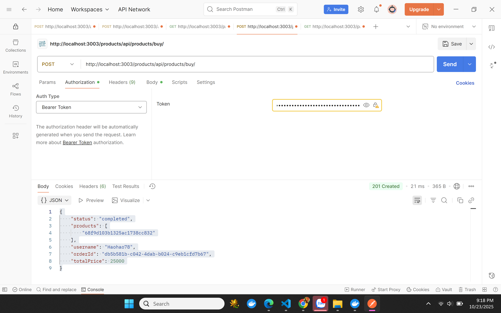
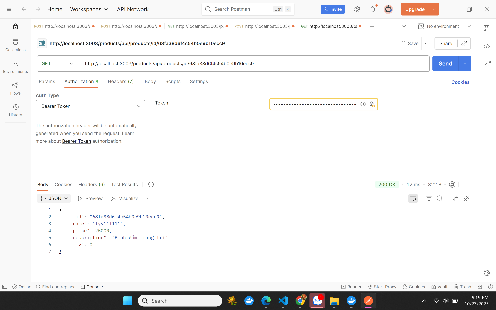

# EProject – Microservices System
## Giới thiệu

Dự án EProject bao gồm các service chính:

Auth Service – Xác thực và đăng ký người dùng

Product Service – Quản lý sản phẩm

Order Service – Xử lý đơn hàng

API Gateway – Cổng giao tiếp tập trung giữa client và các service

RabbitMQ – Message broker để giao tiếp giữa các service

MongoDB – Cơ sở dữ liệu NoSQL lưu thông tin người dùng, sản phẩm và đơn hàng

## Cài đặt
### Download source code
git clone <https://github.com/haohaoo78/22682921-DoanThiMyHao-EProject.git>

cd EProject

### Cài đặt dependencies
Trong từng service (cd services), chạy:

npm install

### Thiết lập microservices

File docker-compose.yml đã cấu hình sẵn các service:

mongo (database)

rabbitmq (message broker)

auth (authentication)

product (product management)

order (order handling)

gateway (API gateway)

### Tạo file .env cho từng service

#### auth/.env

MONGODB_AUTH_URI=mongodb://<mongo_host>:27017/authdb

JWT_SECRET=<your_jwt_secret_key>

#### product/.env

MONGODB_AUTH_URI= mongodb://<mongo_host>:27017/authdb

MONGODB_PRODUCT_URI= mongodb://<mongo_host>:27017/productdb

JWT_SECRET=<your_jwt_secret_key>

#### order/.env

MONGODB_ORDER_URI=mongodb://<mongo_host>:27017/orderdb

MONGODB_AUTH_URI=mongodb://<mongo_host>:27017/authdb

MONGODB_PRODUCT_URI= mongodb://<mongo_host>:27017/productdb

JWT_SECRET=<your_jwt_secret_key>

### Chạy toàn bộ hệ thống bằng Docker

docker-compose up --build

### Sau khi chạy, hệ thống hoạt động ở:

Auth Service: http://localhost:3000

Product Service: http://localhost:3001

Order Service: http://localhost:3002

API Gateway: http://localhost:3003

RabbitMQ Dashboard: http://localhost:15672
 (user: myname, pass: mypass)

MongoDB: mongodb://localhost:27017
(default database: authdb, productdb, orderdb)

## Kiểm thử bằng Postman

Cổng Gateway: 3003

Các service giao tiếp thông qua API Gateway để đảm bảo tính bảo mật và thống nhất endpoint.

### Auth Service - Port 3000

POST /auth/register → Đăng ký tài khoản

check in database

POST /auth/login → Đăng nhập, nhận JWT token

### Product Service - Port 3001

POST /products/api/products → Tạo sản phẩm (cần JWT token)

check in database

GET /products/api/products → Lấy danh sách sản phẩm

POST products/api/products/buy/ → Đặt hàng sản phẩm

### Order Service - Port 3002
Tự động nhận dữ liệu đơn hàng được gửi từ Product Service thông qua RabbitMQ và lưu trữ vào MongoDB.

.