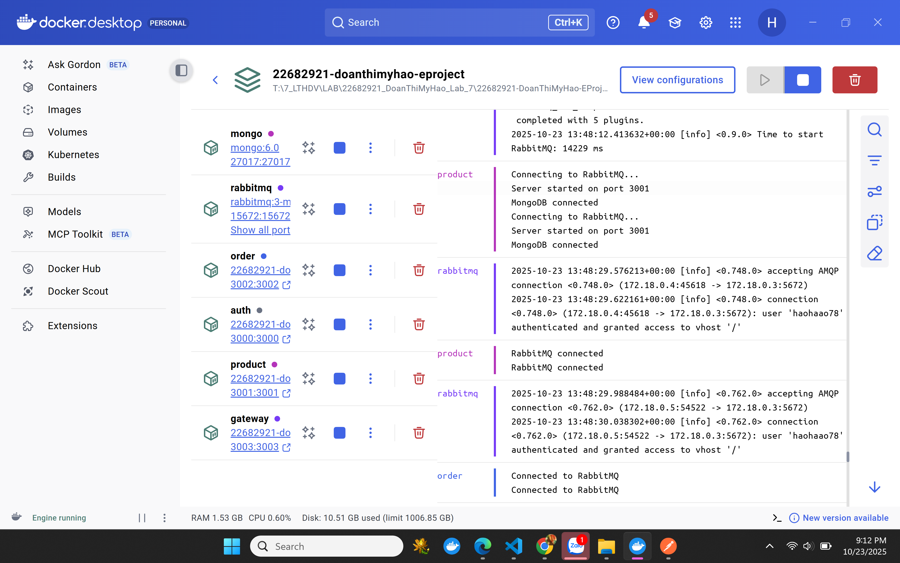
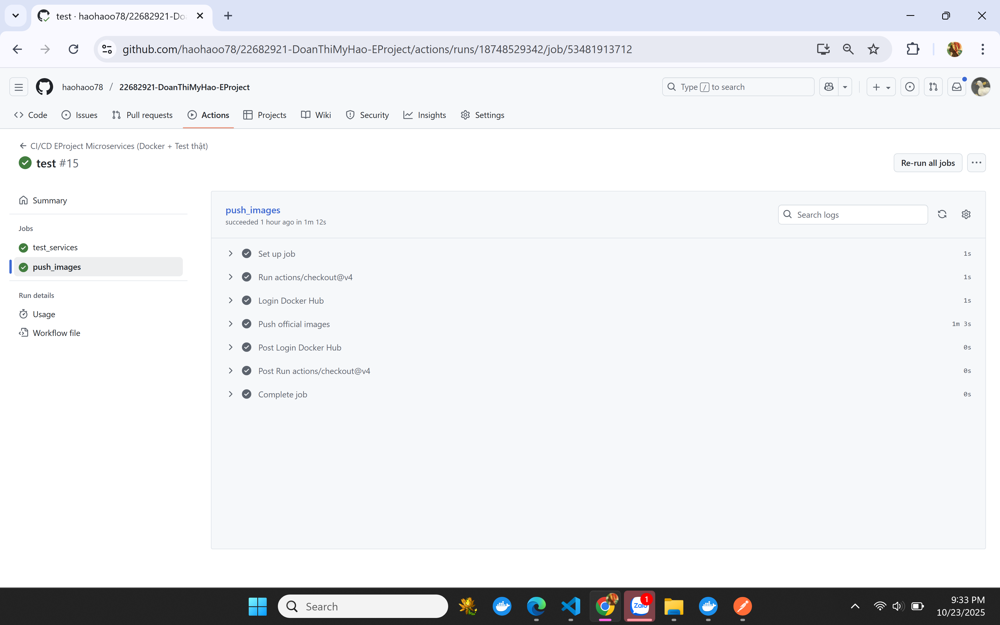

# EProject – Microservices System

## 1. Giới thiệu

EProject là hệ thống Microservices quản lý sản phẩm, đơn hàng và người dùng, đảm bảo tách biệt, mở rộng và bảo mật.

5 ý tóm tắt:

Vấn đề giải quyết: Quản lý người dùng, sản phẩm, đơn hàng, tách biệt dữ liệu và bảo mật.

Số lượng dịch vụ: 4 service chính (Auth, Product, Order, API Gateway) + hạ tầng (RabbitMQ, MongoDB).

Ý nghĩa từng service:

Auth: Xác thực và quản lý người dùng

Product: Quản lý sản phẩm, đặt hàng

Order: Xử lý đơn hàng

API Gateway: Tập trung request và bảo vệ endpoint

RabbitMQ: Giao tiếp bất đồng bộ giữa service

MongoDB: Lưu dữ liệu riêng

Mẫu thiết kế: Microservices, Repository/Service, Event-driven, API Gateway.

Cách giao tiếp: Client → Gateway → Service; Product → Order qua RabbitMQ; mỗi service dùng DB riêng.

## 2. Cài đặt
### 2.1. Download source code
git clone https://github.com/haohaoo78/22682921-DoanThiMyHao-EProject.git

### 2.2. Cài đặt dependencies

Trong từng service:

npm install

### 2.3. Thiết lập môi trường

#### Tạo file .env cho từng service:

#### auth/.env

MONGODB_AUTH_URI=mongodb://mongo:27017/authdb_test

JWT_SECRET=<your_jwt_secret_key>

LOGIN_TEST_USER=testuser

LOGIN_TEST_PASSWORD=password

#### product/.env

MONGODB_AUTH_URI=mongodb://mongo:27017/authdb_test

MONGODB_PRODUCT_URI=mongodb://mongo:27017/productdb_test

JWT_SECRET=<your_jwt_secret_key>

RABBITMQ_HOST=rabbitmq

RABBITMQ_PORT=5672

RABBITMQ_USER=name_test

RABBITMQ_PASS=pass_test

#### order/.env

MONGODB_ORDER_URI=mongodb://mongo:27017/orderdb_test

MONGODB_AUTH_URI=mongodb://mongo:27017/authdb_test

MONGODB_PRODUCT_URI=mongodb://mongo:27017/productdb_test

JWT_SECRET=<your_jwt_secret_key>

RABBITMQ_HOST=rabbitmq

RABBITMQ_PORT=5672

RABBITMQ_USER=name_test

RABBITMQ_PASS=pass_test

### 2.4. Chạy hệ thống bằng Docker

docker-compose up --build

# 3. Kiểm thử bằng Postman

## Cổng Gateway: 3003

## Auth Service:

### POST /auth/register – Đăng ký

-- check in database

### POST /auth/login – Đăng nhập, nhận JWT token

## Product Service:

### POST /products/api/products – Tạo sản phẩm (cần JWT token)
-- Khi không truyền vào token

-- Khi có token

-- check in database 

### GET /products/api/products – Lấy danh sách sản phẩm

### POST /products/api/products/buy – Đặt hàng

### GET /products/api/products/id – Xem thông tin sản phẩm theo mã sản phẩm 

## Order Service:

### Tự động nhận đơn hàng từ Product Service qua RabbitMQ và lưu MongoDB

-- check in database

# 4. CI/CD (GitHub Actions)

## Hệ thống sử dụng GitHub Actions để tự động:

## Build Docker image cho từng service.

## Test các service bằng container tạm.

## Push Docker image chính thức lên Docker Hub nếu tất cả test pass.

